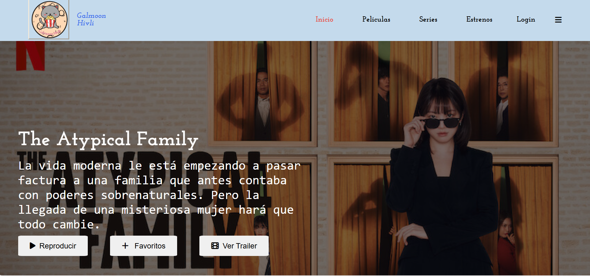

# Galmoon
Es una página diseñada por mi con el concepto de un clon de una página de películas
Esto fue creado a una inspiración de Netflix y paginas gratuitas de películas con el fin de innovar y aplicar todos los conocimientos que he adquirido durante estos meses
con el tiempo pienso mejorar la página y hacer que funcione al 100% por el momento solo fue una prueba

### Tecnologías Utilizadas
+ *HTML5:* Para la estructura básica del sitio.
+ *CSS3:* Para el diseño y el estilo, incluyendo flexbox para un diseño responsivo y efectos de hover.
+ *Google Fonts:* Para fuentes personalizadas.

### Vista Previa del Proyecto

### Contacto
Si te gustaría invitarme a colaborar en un proyecto, escríbeme por [LinkedIn](https://www.linkedin.com/in/lesly-gabriela-quiroz-bueno-b0b346183)
